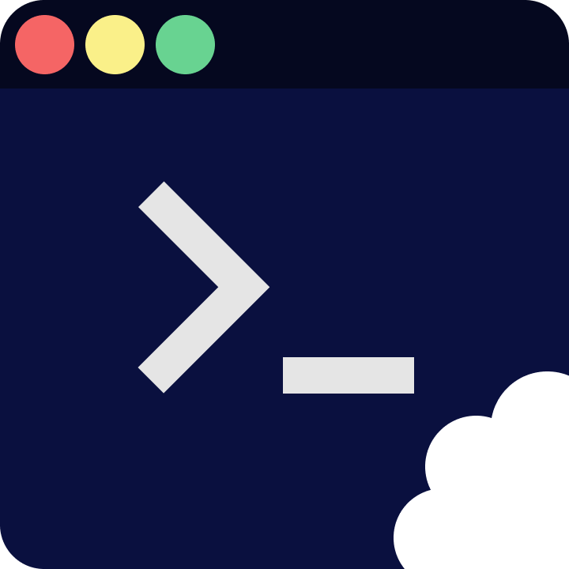
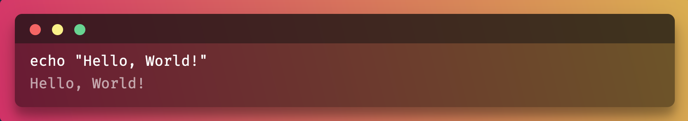

<h1 style="display: flex; align-items: center;">

&nbsp;&nbsp;Terminal Byte
</h1>

Create and share your terminal commands with style.

## License

BSD-2

## Contribute

We welcome any contribution to the project. Everything is built using `parcel` and powered by `react`. Just `clone` the project run `npm install` or `yarn install` to add your contribution.

## Test

Run `npm test` to run all the tests. This test suit is run through `jest`.

## Author

[Guzmán Monné](htttps://twitter.com/guzmonne)